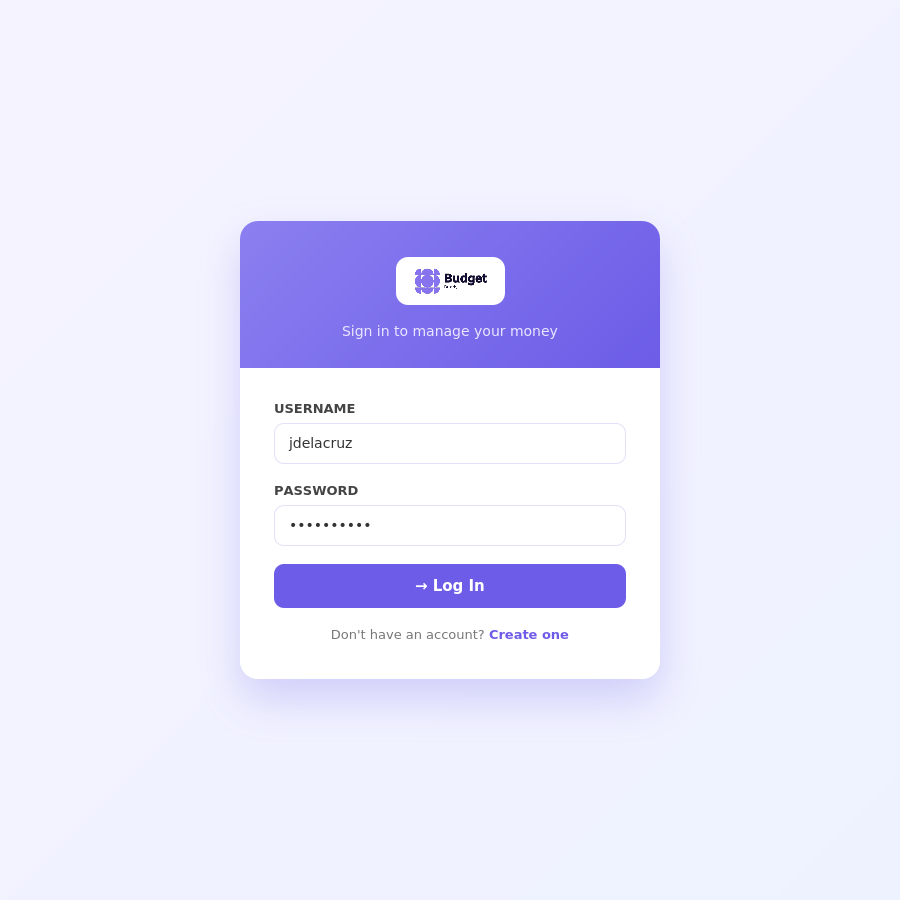
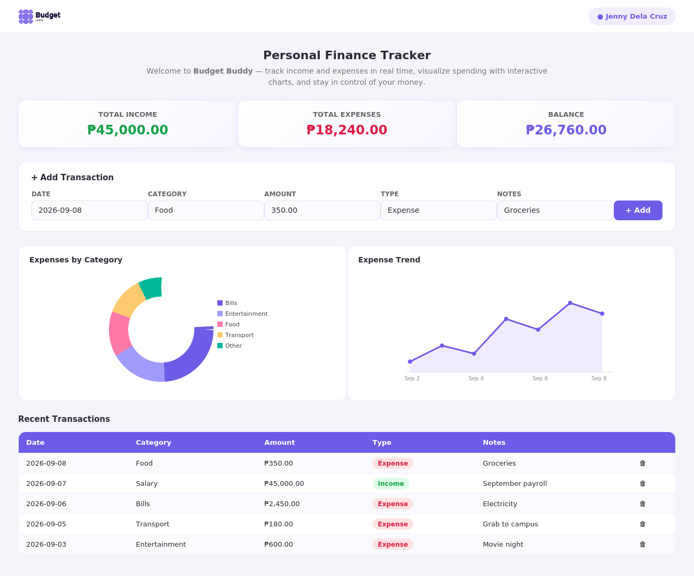
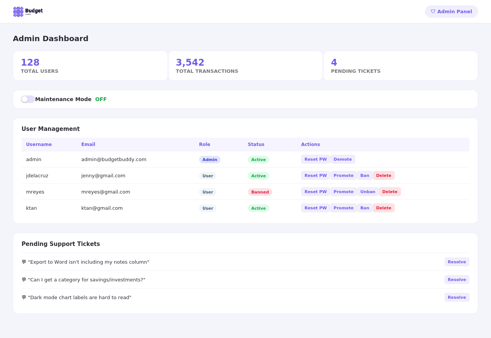
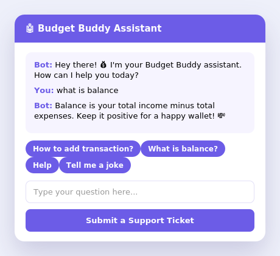

<p align="center">
  
</p>

<h1 align="center">Budget Buddy</h1>

<p align="center">
  A Flask-based personal finance tracker for logging income and expenses, visualizing spending, and exporting reports — with a built-in admin console and support chatbot.
</p>

<p align="center">
  
  
  
  
  
  
</p>

---

Budget Buddy is a full-stack web app that combines a **Flask backend, SQLAlchemy/SQLite database, Flask-Login authentication, and Chart.js visualizations** into a single personal finance dashboard — letting users log transactions, track their balance, and export their history, while admins manage accounts and support requests from one console.

> **Note:** The screenshots below are rendered mockups built from this repo's actual templates and stylesheet (not live deployment captures), since the original database and hosted instance aren't part of this repo. Swap in real captures under `docs/screenshots/` whenever you'd like.

---

## 📑 Table of Contents

- [Features](#-features)
- [Screenshots](#-screenshots)
- [System Architecture](#%EF%B8%8F-system-architecture)
- [Technology Stack](#%EF%B8%8F-technology-stack)
- [Repository Structure](#-repository-structure)
- [Local Setup](#-local-setup)
- [Default Admin Account](#-default-admin-account)
- [Security & Privacy](#-security--privacy)
- [Database & Runtime Data](#-database--runtime-data)
- [Academic Context](#-academic-context)
- [My Role](#-my-role)
- [Future Improvements](#-future-improvements)
- [License](#-license)
- [Author](#-author)

---

## ✨ Features

- 💸 **Transaction Tracking** — Add income and expense entries with date, category, amount, and notes, scoped to each logged-in user.
- 📊 **Live Dashboard** — Real-time income, expense, and balance summary cards, plus a category breakdown (pie) chart and an expense-trend (line) chart powered by Chart.js.
- 🗂️ **Filters & Pagination** — Filter transactions by today, this week, this month, or a specific date, with paginated results.
- 📄 **Word Export** — Export transaction history to a formatted `.docx` report via `python-docx`, filterable by day, week, month, last week/month, or a custom date range.
- 🎨 **Light/Dark Mode** — Theme toggle persisted with `localStorage`, applied through CSS custom properties.
- 🤖 **Support Assistant** — A lightweight in-app chatbot widget that answers common questions (adding/deleting transactions, exporting, balance, etc.) and can hand off to a support ticket form.
- 🎫 **Support Tickets** — Users can submit tickets from the chatbot; admins review and resolve them from the admin console.
- 👤 **Profile Management** — Users can update their name, age, birthday, email, and password (with current-password verification).
- 🛡️ **Admin Console** — Manage user accounts (create, promote/demote, ban/unban, reset password, delete), toggle site-wide maintenance mode, and monitor total users/transactions.
- 🔐 **Authentication & Security** — Flask-Login session management, Werkzeug password hashing, and CSRF protection via Flask-WTF on all forms.
- 💾 **Local Database** — SQLite storage via SQLAlchemy, auto-initialized on first run (including a default admin account).

---

## 🖼️ Screenshots

### Login — role-based sign-in
Simple, centered sign-in screen for returning users.

<p align="center"></p>

### Dashboard — income, expenses, and spending charts
Summary cards, a quick-add transaction form, an expense-by-category breakdown, an expense trend line chart, and the recent transactions table.

<p align="center"></p>

### Admin Console — users, maintenance mode, and tickets
User management (promote, ban, reset password, delete), a maintenance-mode switch, and pending support tickets.

<p align="center"></p>

### Support Assistant — in-app chatbot
Quick-prompt buttons for common questions, with a fallback to a support ticket form.

<p align="center"></p>

---

## 🏗️ System Architecture

**Data flow**

1. The user interacts with the Flask web app (`routes.py` / `auth.py`) in the browser to log in, add transactions, or request an export.
2. Flask reads/writes the SQLite database through SQLAlchemy models (`User`, `Transaction`, `Ticket`).
3. Dashboard chart data (category totals, expense trends) is aggregated server-side and rendered client-side with Chart.js.
4. Export requests are built on-the-fly into a `.docx` file with `python-docx` and streamed back as a download — no report is persisted on disk.
5. Admin actions (ban, promote, reset password, resolve ticket, toggle maintenance mode) go through the `/admin` route, gated by `current_user.role == 'admin'`.

---

## 🛠️ Technology Stack

<div align="center">

| Category | Technologies |
|:---:|:---:|
| **Backend** | Python, Flask |
| **Frontend** | HTML, CSS, JavaScript, Bootstrap 5, Bootstrap Icons |
| **Database** | SQLite via SQLAlchemy (Flask-SQLAlchemy) |
| **Auth & Security** | Flask-Login, Flask-WTF (CSRF), Werkzeug Password Hashing |
| **Data Viz** | Chart.js |
| **Reporting** | python-docx |

</div>

---

## 📂 Repository Structure

```text
budget_buddy/
│
├── run.py                       # App entry point
├── requirements.txt              # Python dependencies
│
├── app/
│   ├── __init__.py               # App factory, config, default admin seeding
│   ├── routes.py                 # Dashboard, transactions, export, profile, admin routes
│   ├── auth.py                   # Login, register, logout routes
│   ├── models.py                 # User, Transaction, and Ticket models
│   │
│   ├── static/
│   │   ├── css/styles.css         # Light/dark theme variables and layout styles
│   │   ├── js/chart.js            # Chart.js library
│   │   └── logo.png               # App logo
│   │
│   └── templates/
│       ├── base.html              # Shared layout, navbar, theme toggle, chatbot widget
│       ├── login.html
│       ├── register.html
│       ├── dashboard.html         # Main authenticated view
│       └── admin.html             # Admin console
│
├── instance/
│   └── budget_buddy.db            # SQLite database (created at runtime)
│
└── docs/
    └── screenshots/               # README screenshots
```

---

## 🚀 Local Setup

### 1. Clone the repository

```bash
git clone https://github.com/<your-username>/budget-buddy.git
cd budget-buddy
```

### 2. Create a virtual environment

```bash
python3 -m venv .venv
source .venv/bin/activate
```

For Windows:

```powershell
python -m venv .venv
.venv\Scripts\activate
```

### 3. Install dependencies

```bash
pip install -r requirements.txt
```

### 4. Run the app

```bash
python run.py
```

The database (`instance/budget_buddy.db`) and a default admin account are created automatically on first run. The development server will normally be available at `http://localhost:5000`.

> ⚠️ Before deploying anywhere beyond local testing, change `SECRET_KEY` in `app/__init__.py` to a securely generated value, and move it (along with the database path) into an environment variable rather than hard-coding it.

---

## 🔑 Default Admin Account

On first run, if no users exist yet, Budget Buddy seeds one admin account:

| Field | Value |
|---|---|
| Username | `admin` |
| Password | `admin123` |

**Change this password immediately after your first login** — it's a well-known default and should never be left active outside local development.

---

## 🔐 Security & Privacy

- Passwords are hashed with Werkzeug's `generate_password_hash` / `check_password_hash` — plaintext passwords are never stored.
- All state-changing forms (adding a transaction, updating a profile, admin actions) are protected with Flask-WTF CSRF tokens.
- Transactions are always scoped to `current_user.id`, so one user can never read or modify another user's data.
- Admin-only routes check `current_user.role == 'admin'` before allowing any account or maintenance-mode changes.
- The included `instance/budget_buddy.db` (if present in your checkout) should be treated as sample/demo data only — never commit a database containing real user records, and add `instance/` to `.gitignore` for any real deployment.

---

## 💾 Database & Runtime Data

Budget Buddy uses a single SQLite file at `instance/budget_buddy.db`, auto-created by `db.create_all()` the first time the app runs. It stores three tables: `user`, `transaction`, and `ticket`.

To fully reset a local installation, stop the app, delete `instance/budget_buddy.db`, and restart — a fresh database and default admin account will be recreated automatically.

---

## 🎓 Academic Context

**Budget Buddy** was built as a personal/academic full-stack project focused on:

- Flask application structure with blueprints (`main`, `auth`)
- Relational data modeling with SQLAlchemy
- Session-based authentication and role-based access control
- Client-side data visualization with Chart.js
- Server-side report generation (Word export via `python-docx`)
- Basic conversational UI (rule-based support chatbot)

---

## 👨‍💻 My Role

**Solo Developer**

- Designed the data model (users, transactions, support tickets)
- Built the Flask routes for the dashboard, authentication, and admin console
- Implemented transaction filtering, pagination, and the Chart.js dashboard visualizations
- Built the Word (.docx) export feature with configurable date-range filters
- Implemented the admin console (user management, maintenance mode, ticket review)
- Added the light/dark theme system and the in-app support chatbot

---

## 📈 Future Improvements

- Move `SECRET_KEY` and database path into environment variables / `.env`
- Recurring transactions and budget limits per category
- Multi-currency support (currently the currency selector is display-only)
- Server-side ticket notifications for admins
- Automated tests for routes and models
- Replace the rule-based chatbot with a more flexible FAQ/help search

---

## 📄 License

This project was developed as a personal/academic project. If you intend to reuse, modify, or redistribute it, please contact the author first.

---

## 👤 Author

**Your Name**
_(replace with your name / program / school)_

- **GitHub:** [@your-username](https://github.com/your-username)
- **Email:** [you@example.com](mailto:you@example.com)

---

<p align="center"><strong>Track it. Understand it. Save it.</strong> — Budget Buddy</p>
